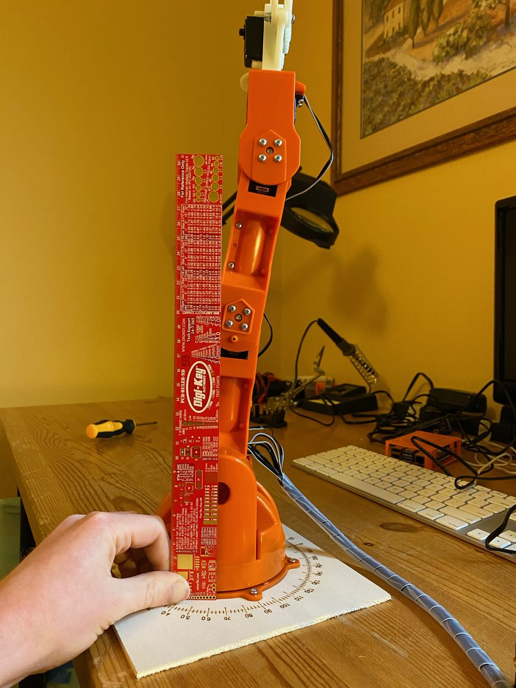

# Alignment

The image below shows the alignment of my arm after assembly. Alignment can be tested with the [testBraccio90 sketch](https://github.com/arduino-libraries/Braccio/blob/master/examples/testBraccio90/testBraccio90.ino), which should orient the arm in a vertical position. 

Realigning the arm is possible, but from the point pictured may require significant disassembly to reach the lower servos. 

To realine the SR 311 servos simply remove the set screw inserted during assembly, remove the mating plastic piece, and then reassert it in the correct orientation. Then reassemble. I was able to realign servo 5 successfully with this technique.

To realign the SR 431 servos dissable so that the servo is free. Then remove the screw in the center of the plastic pentagon attached to the servo, and remove and replace the plastic pentagon so that it has the correct orientation. It however may not be possible to get the arm to be perfectly straight with this technique. There are a finite number of teeth to align to and the servo, and it's possible that none of them will give perfect alignment. 

I dissabled such that I had access to servo 3, but after adjustment it was not much straighter. I have not tried to re-adjust any of the other SR 431 servos.

## Align Before Assembly?

Due to the difficulty to reline the servos after assembling the arm it may make sense to align first. This could be done by connecting the servos to the motor shield and running the testBraccio90 sketch, and then aligning based only on the orientation of the plastic pentagons.

This approach has the benefits of saving time on disassembling, saving stress on the plastic from being screwed multiple times, and by testing the electronics prior to mechanical assembly.

I did not try to align before assembly. If you have please update the instructions with your results.
