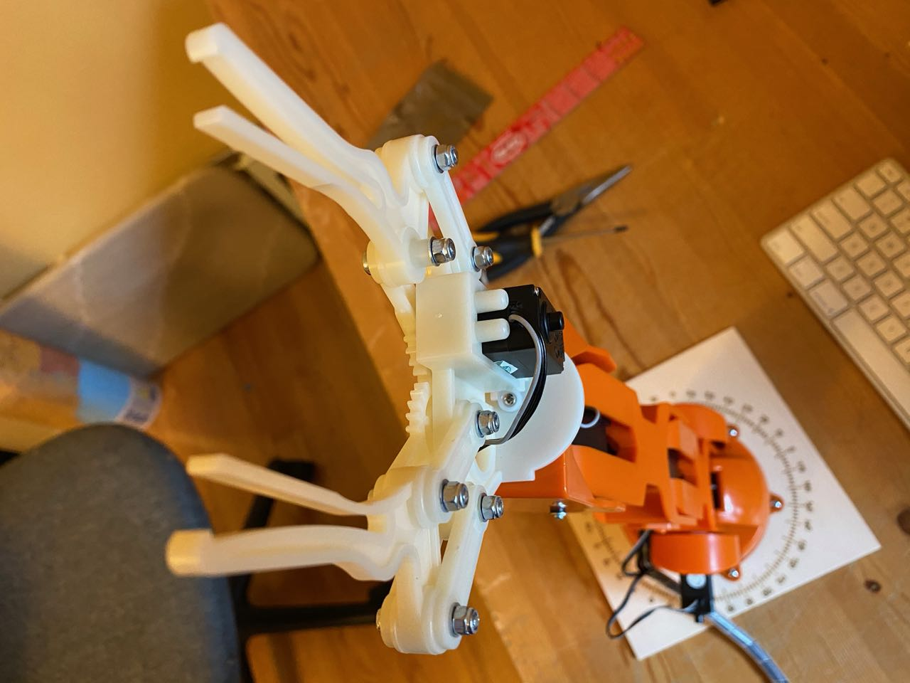

# Assembly

This page is meant to supplement the instruction manual that comes with the Braccio. The step numbers below correspond to the steps in the [manual](https://docs.rs-online.com/e477/0900766b814da22f.pdf). Some of the manual steps are straightforward and I omit them from this guide.

In addition to this guid I recommend checking out the [official assembly video](https://www.youtube.com/watch?v=Lwb2ppat_bs&feature=emb_title)

## Before you begin

* Read the [note on alignment](alignment.md). It may make sense to align the servos before building.

* Not all the sizes of screws have extras. Be careful

* In addition to the tools the Braccio comes with I recommend having tweezers and needle nose pliers on hand. The screwdriver that comes in the box has a magnetic tip, if you don't like that you need a phillips head screwdriver as well

* It pays to use proper mechanical assembly techniques in this build. Specifically insert and partially tighten all screws before fully tightening any of them.

* The motors have numbers on their JST connectors. The manual refers to the motors by these numbers.

  

* All the hardware comes mixed together in a bag. A guide on screw sizes is below:
  

## Step 0

Unpack the box and make sure you have all the parts. The motors can have some grease on them, so keep paper towels on hand. I recommend sorting the screws before you start building.

## Step 1

The cutout in the plastic for the servo motor cable to pass through is not quite big enough. This makes it hard to get the motor into place. I don't have specific advice on this, but I played with it for a while and eventually got it to sit correctly.

## Step 2+3

Dealing with the springs is the hardest part of the build. A few hints:

* The spring does not technically have an orientation, but it will go together one way easier than the other due to how it is made. Try to dry fit it before attaching it
* Clip the spring to the short piece of plastic before screwing it to the long piece. This is the opposite of what the instructions say
* If the spring will not clip into the hole *carefully* use the needle nose pliers to bend the hook at the end and make it larger. Close the hook back once it is attached

## Step 5

Do not screw the spring in at this point. It is easier to attach the spring to the small piece in Step 7 before screwing it to this piece.

## Step 6

The wire should stay between the two pieces of plastic. It should not go out through the wire hole cutout.

Picture for later in the build, but shows how the cable should be routed

## Step 7

See Step 2+3 for advice on attaching the spring. Once it is clipped in screw it to the long piece of plastic as described in Step 5.

## Step 8

Pay careful attention to the orientation of the servo in the base. It is possible to install it backwards.

## Step 9

The bottom servo should be on the **left** side of the base when viewed from the front.  Please see the picture below:

In the manual the image on the right hand side of the Step 9 panel is incorrect. The motor orientation is shown correctly in all other pictures in the manual.

## Step 10

Make sure to insert all the screws before fully tightening any to insure proper alignment. When tightening make sure to hold onto the base plat or it will spin.

## Step 13

As with Step 6 the wire should stay between the two pieces of plastic.

## Step 14

Pay careful attention to the orientation of the servo. It is possible to install it backwards.

## Step 16

Make sure the small plastic piece is under the vertical rectangle.

## Step 17

It is difficult to get the servo into place. Be Careful of the wire and be patient. There is a satfising click when the servo is seated correctly.

## Step 18

There are two similar but distinct gears. It is difficult to use the wrong one.

## Step 19

There is a lot going on in this step:

* Note that there are two cross bars, one that goes above and one that goes below
* The cross bars have a flange. Make sure the wider part is facing in so that is seated against the gripper and the gear mechanism.
* Washers should be used on the top and the bottom sides
* To use the locking nuts hold them in place while tightly while screwing

## Step 20

Same advice as Step 19. This side has three cross bars and the gear bar.

## Step 21

The gripper needs to be open in order to reach the screw.

## Cable Routing

The cables should pass through the tubes in the center of the arm. I recommend watching the [end of the assembly video](https://youtu.be/Lwb2ppat_bs?t=827) to see how they weave the cables through.

## Connect to Motor Shield

The JST connectors connect to the headers on the shield labeled "motor". They connect in order with motor 1 being closest to the barrel connector.

In the pictures below the shield is connected to an Arduino Uno. The Uno is sitting in a [case](https://www.thingiverse.com/thing:26237). This is not necessary, but it is nice to keep the electronics up off the table.

